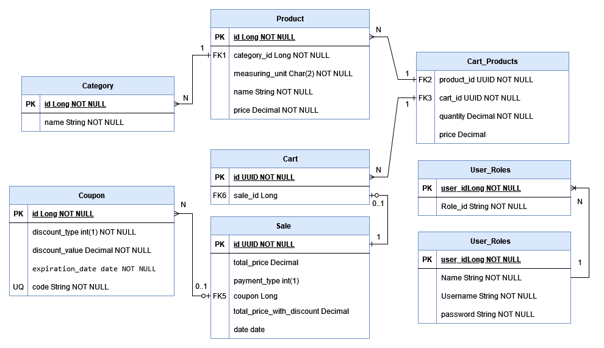

<h1>JuMarket-API</h1>

API Rest para JuMarket

     
    
    
    
    
    
<a>
 
</a>

<h3>Problema proposto</h3>

Uma mercearia do Bairro Bom Descanso chamada JuMarket necessita de uma solução para venda de autoatendimento, para tanto necessitamos desenvolver as seguintes funcionalidades:

<h4>Cadastro de categorias:</h4>

Um cadastro de categorias de produto, apenas contendo a nome da categoria, por exemplo: Produtos de Limpeza, Bebidas, Bombonier, Salgadinhos, Chás e Cafes, Grãos e Cereais e outros;

<h4>Cadastro de produtos:</h4>

Um cadastro contendo os produtos do mercado, este cadastro poderá conter os seguintes campos: 
Nome do produto, unidade de medida, preço unitário;

<h4>Carrinho</h4>

O carrinho é a funcionalidade na qual o usuário selecionou os produtos que deseja adquirir, neste caso conter os seguintes dados: produto, quantidades de itens e o preço de venda;

<h4>Finalização da venda:</h4>

Ao finalizar a venda deverá ser informado o valor total e a forma de pagamento escolhida, as opções são: Cartão de crédito/ débito / dinheiro e pix;

<h4>Restrições:</h4>

A implementação deve utilizar linguagem backend: Kotlin com o Springboot, o Banco de dados utilizado tem que subir via docker, utilizar um gerenciador de migration (Flyway, Liquibase ou outro);  JuMarket Use todos os seus conhecimentos adquiridos no bootcamp para explorar bem a solução. Não se preocupe, porque não existe certo ou errado. Só queremos conhecer um pouco mais sobre você. Caso queira implementar alguma funcionalidade não descrita sinta-se à vontade tudo será considerado na análise do seu código, inclusive não se esqueça dos testes, nossa sugestão é utilizar o Junit para testar pelo menos a camada de serviço;  Utilize o GitHub para repositório de código.

<h3>Descrição da Solução</h3>

<h4>Alterações do problema proposto</h4>

Como solução decidi incrementar a solução adicionando uma opção do cliente adicionar um cupom para a compra que pode dar um desconto fixo de X ou um de desconto percentual de X%.

Para as propriedades de produto foi adicionando o produto pertencer há uma categoria e adicionado a propriedade de preço para o produto.

E para finalizar a venda foi adicionado a possibilidade de adicionar um cupom de desconto, o valor de venda com desconto, valor total da venda, data da venda.

Como meta de qualidade foi estipulado uma cobertura mínima de 90% de código.

<h4>API Publica de JuMarket</h4>

Para a parte pública da API tem as seguintes opções:

* Buscar produtos por nome
* Listar produtos disponíveis
* Listar produtos por Categoria
* Listar Categorias
* Criar carrinho com produtos
* Adicionar produto no carrinho
* Alterar quantidade de produtos de um carrinho
* Remover Produto do carrinho
* Listar Informações do carrinho
* Finalizar compra do carrinho

<h4>API Privada de JuMarket</h4>

Para a parte privada da API, somente o usuário autenticado tem os seguintes opções:

* Cadastrar categoria
* Excluir categoria
* Cadastrar cupom
* Listar cupons
* Cadastrar produto
* Atualizar produto
* Informações de um produto
* Listar vendas de um dia

<h4>Validações que a API</h4>

* Validação de campos obrigatórios das requisições
* Não pode excluir uma categoria que já tenha um produto associado a ele
* Um cupom tem que te um código diferente de um outro
* Um Produto não pode ter o mesmo nome de um outro
* Se o cupom é valido para a aplicação do desconto
* Não pode ser adicionado um produto duplicado no carrinho, para isso deve alterar a quantidade de itens da compra do carrinho
* Não pode finalizar a compra de um carrinho já finalizado
* Não pode alterar a quantidade de produtos de um carrinho já finalizado
* Um carrinho não pode ser criado vazio, deve ser criado com pelo menos 1

<h4 align="center">Diagrama ER do banco de dados do JuMarket</h4>
<figure>

   

</figure>

<h3>Possíveis melhorias para a solução proposta:</h3>

Nesse tópico está as possíveis melhorias que podem ser efetuada na estrutura, mas pelo tempo do desafio não será implementado

* Colocar uma data de expiração para o carrinho
* Desativar a venda de um produto
* Criar um cadastro de usuário para realizar uma compra
* Cupons ter um limite de uso
* Listar compras realizadas em uma faixa de tempo
* Adicionar quantidade disponível para venda de um produto
* Paginações para as listagens de produto, categoria, carrinhos, vendas, cupons
* Melhora dos tratamento dos nullables
* Melhorar no retorno de erro da api, principalmente nos erros com relação ao banco de dados

<h3>Como executar o projeto:</h3>

